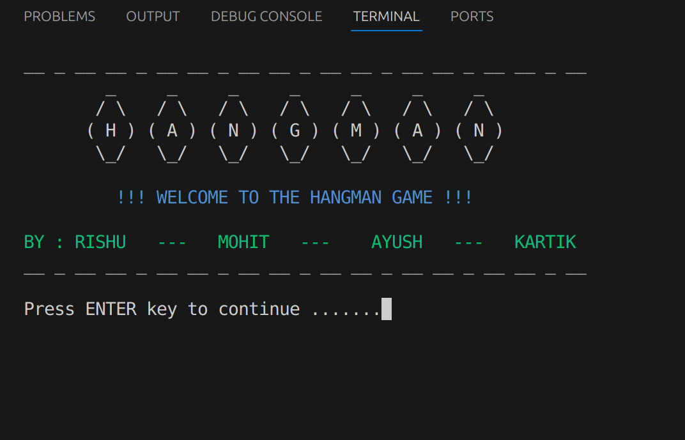
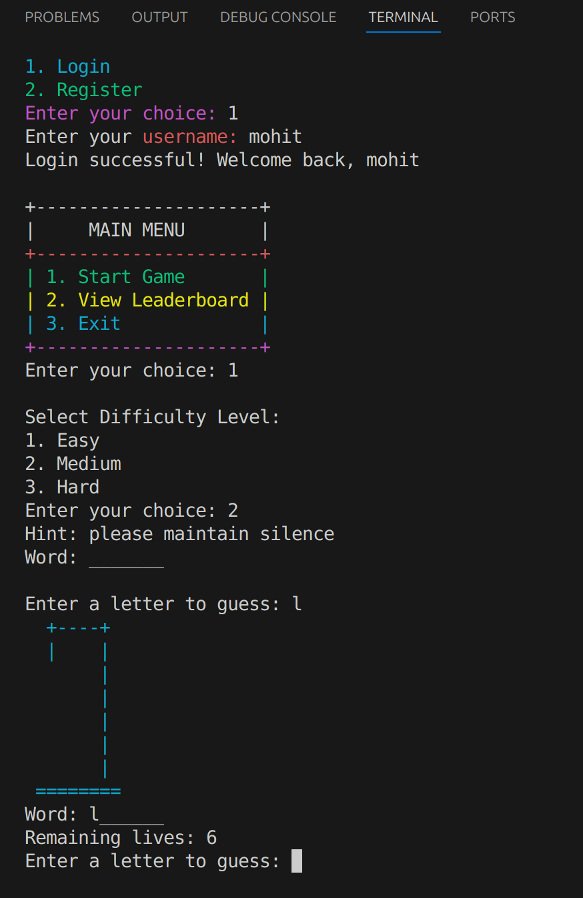
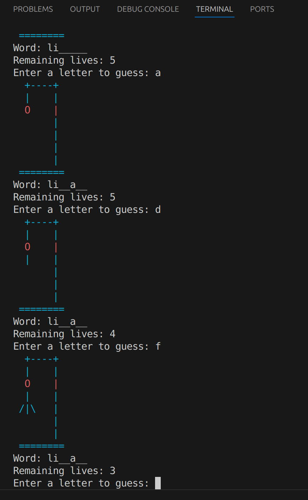

# Hangman Game in C

Welcome to the Hangman game built using C!   
In this game, you’ll guess letters to figure out a hidden word, and try to avoid the making of hangman figure.  
The completion of figure is the end of you game.....so be carefull.   
You can also keep track of your score on a leaderboard!

## Snapshots1





## Features we added

- **User Profiles**: Create and save your profile with your username and score.
- **Leaderboard**: View the top players and their scores.
- **Hangman Game**: Play the classic word-guessing game with 3 difficulty levels (Easy, Medium, and Hard).
- **Colorful Display**: The game has a colorful terminal UI to make the experience more fun!
- **Game Over & Score**: If you guess wrong, the hangman gets drawn. If you guess the word, you win and earn points!

## How to Play

1. **Login/Register**: Login to your profile
2. **Start the Game**: Choose your difficulty (Easy, Medium, or Hard).
2. **Guess the Word**: You’ll be given a hint. Guess letters to figure out the word.
3. **Avoid the Hangman**: If you guess too many wrong letters, you lose the game. 
4. **Earn Points**: If you guess the word correctly, you get points that are added to your score.

## How to Run the Game

1. **Clone the Game**:
   First, clone this project to your computer:
   ```bash
   git clone https://github.com/M0-hit/Hangman_Game.git